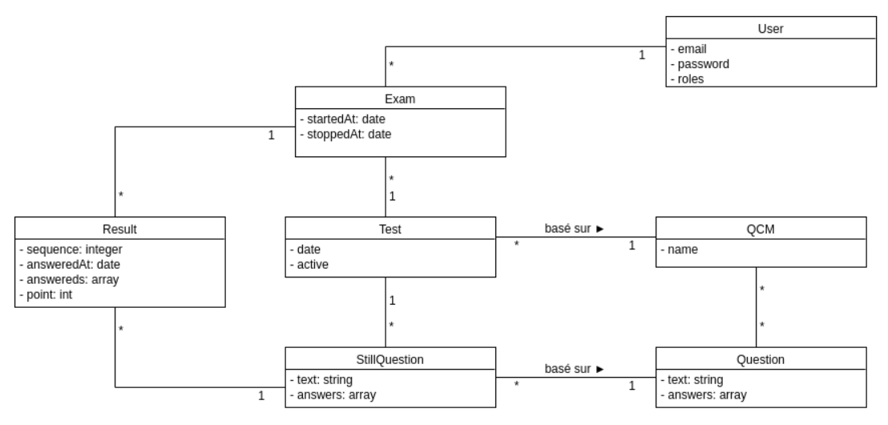

# QCM

## Introduction

Ce projet doit permettre d'évaluer les compétences des élèves.

## Étape de réalisation

1. Lister fonctionnalités attendues
1. Faire un diagramme de classe
1. Créer les entités avec make:entity (pensez à configurer l'accés à votre BDD)
1. Créer les pages attendues avec make:controller
1. Créer le système de gestion des comptes utilisateurs
1. Coder toute la logique métier

### Liste fonctionnalités attendues

* pouvoir créer des questions en markdown
* pouvoir créer des classes d'élèves
* correction automatique des épreuves
* Limitation du temps de réponse de chaque question

## Modélisation

### Diagramme de classe

## Liste Pages

* `/` Page d'accueil
* `/login` Page de connexion
* `/register` Page de création de compte

En tant qu'élève :  
* `/{userId}` Tableau de bord d'un utilisateur
* `/{userId}/exam` Liste des examens lié à l'utilisateur en tant que participant
* `/{userId}/exam/{id}` détail d'un examen
* `/{userId}/exam/{id}/{sequence}` passage d'un l'examen
* `/{userId}/exam/{id}/result` résultat d'un l'examen

En tant que formateur :  
* `/question` liste des questions qu'on a créé
* `/question/new` création d'une nouvelle question
* `/question/{id}` détail d'une question
* `/question/{id}/edit` modification d'une question
* `/qcm` liste des qcms qu'on a créé
* `/qcm/new` création d'une nouvelle qcm
* `/qcm/{id}` détail d'un qcm
* `/qcm/{id}/edit` modification d'un qcm
* `/test` liste des tests qu'on a créé
* `/test/new` création d'une nouvelle test
* `/test/{id}` détail d'un test
* `/test/{id}/edit` modification d'un test
